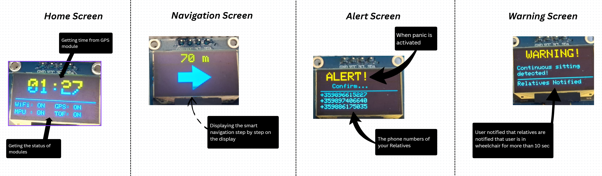

# WheelMate
> Modular smart wheelchair platform improving mobility, safety and independence for wheelchair users via real-time GPS tracking and SOS emergency alerts.

---

## Table of Contents
- [Introduction](#-introduction)
- [Features](#-features)
- [API Documentation](#-api-documentation)
- [Hardware Schematics](#-schematic)
- [Tech Stack](#-tech-stack)
- [Installation Guide](#-installation-guide)
- [Usage](#-usage)
- [Future Improvements](#-future-improvements)
- [License](#-license)

---

## Introduction

**The problem:**
- In emergency situations, users often cannot call for help quickly or reliably.
- Wheelchair users lack smart tools for real-time navigation adapted to their mobility needs.
- Family members have no way to remotely monitor the user's location or safety.
- Wheelchair users often struggle to find accessible routes suitable for their mobility needs.

**Our solution:**

WheelMate is a modular IoT platform for smart wheelchairs. It combines an ESP32-based hardware module with a Spring Boot backend and a mobile app to deliver real-time GPS/GSM tracking, a one-press SOS panic button, and a user-friendly on-device display. It also features an accelerometer-based SOS panic signal that can automatically detect emergencies, along with an intelligent navigation system tailored for wheelchair-accessible routes. Emergency signals are automatically dispatched to registered contacts.

---

## Features

### Core Features
- Real-time tracking of the wheelchair.
- Fall/flip detection with accelerometer sensor, data triggers SOS alert.
- SOS panic button — instantly alerts registered contacts.
- Smart mobility-aware navigation (avoids stairs, curbs, inaccessible routes).
- On-device display (OLED) showing navigation info and real time.
- Logs for panics.
- Sensor indicating whether there is someone in the wheelchair.

### Extra Features
- User authentication with email.

---
## Schematic

---

## OLED Display

---

## API Documentation

Base URL: `http://localhost:7070/api/v2`

---

### Wheelchair

| Method | Endpoint | Description |
|----------|----------|-------------|
| `POST`   | `/wheelchair/add` | Add a wheelchair for the authenticated user. |
| `GET`    | `/wheelchair/my` | Get the wheelchair of the currently authenticated user. |
| `PUT`  | `/wheelchair/update` | Update the wheelchair name of the currently authenticated user. |
| `PATCH`  | `/wheelchair/update/{id}` | Update wheelchair parameters by wheelchair ID. |
| `DELETE` | `/wheelchair/delete` | Delete the wheelchair of the currently authenticated user. |

---

### Panic and fake panic

| Method | Endpoint | Description |
|--------|----------|-------------|
| `GET` | `/panic/get/{id}` | Return a panic by id. |
| `GET` | `/panic/get/all` | Return all panics |
| `GET` | `/panic/wheelchair/{wheelchairId}` | Get wheelchair by id. |
| `GET` | `/fakepanic/get/{id}` | Return a fake panic by id. |
| `GET` | `/fakepanic/get/wheelchair/{wheelchairId}` | Get wheelchair by id. |

---

### Users functionalities

| Method | Endpoint | Description |
|--------|----------|-------------|
| `POST` | `/wheelchair/add-relative` | Add a relative to the authenticated user's account. |
| `GET`  |  `/wheelchair/relative/my-tracked` | Get all wheelchairs tracked by the authenticated RELATIVE user. |
| `GET`  | `/panic/relative/my-tracked` | Return panic logs for all users tracked by the authenticated RELATIVE. |
| `GET`  | `/fakepanic/relative/my-tracked` | Return fake panic logs for all users tracked by the authenticated RELATIVE. |
| `GET`  | `/wheelchair/getallrel` | Get all relatives of the currently authenticated user. |

---

### Authentication

| Method | Endpoint | Description |
|--------|----------|-------------|
| `POST` | `/auth/register?role=` | Register user with email, username, phone and password(?role=USER/RELATIVE/ORGANIZATION). |
| `POST` | `/auth/verify` | Verify user with a code sent to their email. |
| `POST` | `/auth/login` | Login a verified user with email and password. |
| `GET`  | `/auth/get` | Get the currently authenticated user. |
| `GET`  | `/auth/getall` | Get all authenticated users from DB. |

---

## Tech Stack

| Layer | Technology |
|-------|-----------|
| **Firmware** | C++ (Arduino framework), ESP32 S3 |
| **Sensors** | NEO-6M GPS, SIM800L GSM, MPU6050, VL53L0X |
| **Display** | SSD1306 OLED display |
| **Backend** | Spring Boot |
| **Database** | PostgreSQL |
| **Authentication** | JWT |
| **Frontend** | React Native (Expo) |
| **Build tools** | Maven, PlatformIO |

---

## Installation Guide

### Prerequisites
- Java 25+
- Maven 3.9+
- PostgreSQL
- PlatformIO
- Node.js 24+ (for mobile app)

---

## Future Improvements
- Obstacle detection via ultrasonic sensor.
- Joystick-controlled module for intuitive wheelchair navigation.
- Voice control integration for blind people.
- Extended battery life and power management optimization.
- Offline navigation support in low-connectivity areas.

---

## License

This project is licensed under the MIT License — see the [LICENSE](LICENSE) file for details.
